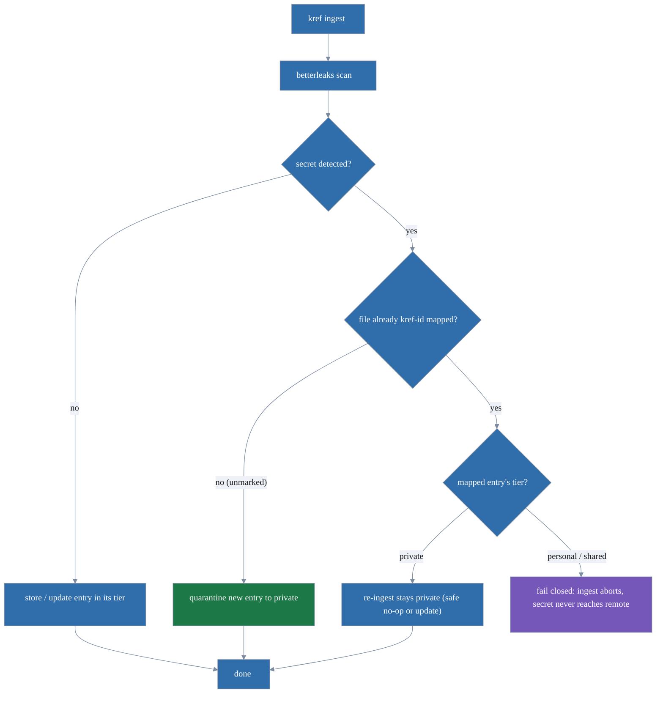

# kref: a repo-resident knowledge base over git objects

[](https://github.com/trevor-vaughan/kref/actions/workflows/test.yml)
[](https://github.com/trevor-vaughan/kref/actions/workflows/lint.yml)
[](https://github.com/trevor-vaughan/kref/actions/workflows/security.yml)
[](https://github.com/trevor-vaughan/kref/actions/workflows/megalint.yml)
[](go.mod)
[](LICENSE)

`kref` stores specs, ADRs, plans, memories, and reference notes inside your git
repository as git objects, under their own ref namespaces — not in your working
tree and not on your `main` branch.

Entry *bodies* travel with the repo (clone, push, pull) without cluttering your file tree, your `git log`, or your `git blame`.

It is built on [git-bug](https://github.com/git-bug/git-bug)'s `entity/dag` framework: every entry is a Lamport-ordered DAG of operations that merges conflict-free across machines and teammates.

> **Status:** pre-release (unversioned). Local-first CLI. See
> [Limitations](#limitations). Until a release is tagged the binary reports a
> `git describe` string (nearest tag + commits + short SHA, or a bare short SHA).

______________________________________________________________________

> 🤖 LLM WARNING 🤖
>
> This project was written with LLM (AI) assistance.
>
> 🤖 LLM WARNING 🤖

______________________________________________________________________

## Demo

**A quick tour**: initialize a store, capture a spec, an ADR, and a private memory across visibility tiers, then list and recall them.


**Secret-aware ingest**: point kref at markdown you already have. One file carries a leaked token; [betterleaks](https://github.com/betterleaks/betterleaks) catches it on the way in and quarantines that entry to the `private` tier, which has no remote and can never be pushed.


<sub>Both demos are rendered with [VHS](https://github.com/charmbracelet/vhs) from the tapes in [`.taskfiles/demo/`](.taskfiles/demo/); regenerate them with `task dev:demo` (needs `vhs`, `ttyd`, and `ffmpeg` on `PATH`).</sub>

______________________________________________________________________

## Why

I was tired of AI agents injecting tons of planning files into my repositories. I also wanted an easy way to keep a running log of issues that I wanted my agents to complete in a way that moved with my repo.

This is very much a work in progress and targeted towards my personal workflow. It is likely to change rapidly for a while.

## What you get

- **Typed entries**:
  - `spec`, `adr`, `plan`, `memory`, `reference`, `document` (free-form `kind`), each with status, links, and author attribution.
- **Three visibility tiers, plus your own**:
  - `private` (never leaves your machine)
     - The private tier is structurally unpushable.
  - `personal` (your devices)
  - `shared` (your team)
  - Any number of custom tiers you declare with `kref tier add`, each with its own remote.
- **Conflict-free sync**: push/pull each tier to a configured remote.
- **Secret-aware ingest**: markdown is scanned with [betterleaks](https://github.com/betterleaks/betterleaks) on the way in
  - Anything that trips a rule is quarantined to the `private` tier.
- **Two-way file tracking**:
  - `track` a markdown file and keep it synced with its entry, in either direction, without committing the file.
- **Git-native excision**:
  - Soft-delete (tombstone) or hard `purge`.

______________________________________________________________________

## Install

`kref` is a Go program (needs Go ≥ 1.26.4)

It needs the [betterleaks](https://github.com/betterleaks/betterleaks) binary at runtime.

```bash
git clone <this-repo> && cd kref
task dev:tools                # installs pinned tools (incl. betterleaks) into ./bin
task build                    # builds ./bin/kref
export PATH="$PWD/bin:$PATH"  # put kref (and the pinned betterleaks) on PATH
kref --help
```

The `export PATH` line makes the examples below (which call bare `kref`)
runnable and puts the pinned `betterleaks` on `PATH` alongside it; add it to your
shell profile to persist it.

Once the repository is public and a release is tagged, `go install` will work.

```bash
go install github.com/trevor-vaughan/kref/cmd/kref@latest
```

<details>
<summary><strong>Releases &amp; supply chain</strong></summary>

Tagged releases are built in CI by GoReleaser.

Each release carries cross-compiled archives (linux/darwin/windows on amd64/arm64) with a `checksums.txt`, an SPDX SBOM per archive (syft), and a Sigstore build-provenance attestation.

To verify that a downloaded binary came from this repo's release workflow:

```bash
gh attestation verify kref_<version>_linux_amd64.tar.gz --repo trevor-vaughan/kref
```

</details>

______________________________________________________________________

## Quickstart

```bash
cd your-project           # any git repo

kref init                   # adopts your git user.name / user.email as the author

# The 90% path: point kref at markdown you already have. Each file becomes an
# entry (kept out of your working tree), with a kref-id trailer written back so
# re-ingesting is idempotent.
kref ingest docs/           # a whole tree (or one file: kref ingest docs/notes.md)
kref hooks install          # optional: re-ingest changed markdown on every commit
kref track docs/note.md     # keep one file two-way synced

# Compose an entry by hand when there is no file:
kref new --kind spec --body $'# Auth design\n\nprose...' --label area:auth  # title from H1

kref list                   # list entries across tiers (add --tier to filter)
kref search auth            # recall by a title/body substring, with match counts
kref show <id>              # view one — rendered and paged; --plain for the raw body
kref show                   # ...or omit the id to see the most-recently-touched entry
kref edit <id>              # revise the body in your editor
kref status <id> accepted   # move it through open|active|accepted|superseded|obsolete
kref rm <id>                # soft-delete (tombstone; undo with kref restore)
```

`kref list` prints a header and a color-coded visibility-tier column so you can
see at a glance what is private vs shared:

```text
TIER        ID            KIND    STATUS  TITLE
● private   d22bdbc58f3f  memory  open    API key location
◐ personal  4179f614a5b3  adr     open    Use Postgres
○ shared    50ca0294f77e  spec    open    Auth flow spec

3 entries
```

Every command takes the global `--json` (machine objects) or `--plain` (chrome-free, line-oriented for `grep`/`cut`/`xargs`) flag.

`list`, `search`, and `show` have rich terminal rendering, paging, sorting, and column control.

See **[the usage reference](docs/usage.md)** for full details.

> Dogfooding: For a truly quick start, try it out in this repo!


______________________________________________________________________

## Concepts

### Entries and tiers

An entry is a typed record (`--kind`, default `document`) with:

- a title
- an optional markdown body
- a status
- typed links
- author attribution

Each entry lives in one **tier**:

- `private` (never leaves the machine)
- `personal` (your remote only)
- `shared` (the team remote)
- [custom tiers](docs/usage.md#custom-tiers)

`kref retier` moves an entry between tiers without changing its id.

See [tiers and visibility](docs/usage.md#tiers-and-visibility) for full details

### Attribution & provenance

Every entry records who created it (`kref init` adopts your git identity; override per shell, per repo, or globally without re-running `init`).

Every `new`/`ingest` also appends an append-only origin event (actor, human-vs-agent, source path) that `kref show` surfaces.

Operations are attributed but not cryptographically signed. Attribution is currently forgeable. Follow git-bug/git-bug/issues/130 for more information.

See [Attribution](docs/usage.md#attribution) · [Provenance](docs/usage.md#provenance) for details.

### History & divergence

Edits never overwrite irrecoverably: every body edit is retained in the
operation DAG.

- `kref log` shows the numbered version timeline
- `kref diff` renders what changed between versions

When the same entry is edited on two machines and synced, kref forms a conflict-free merge and flags it `◆ merged` until you `kref resolve` it. Nothing is lost; nothing is silent.

See [History & divergence](docs/usage.md#history--divergence) for details.

### Hygiene & consolidation

`kref` is built to be written to freely and gardened periodically.

- `kref list` hides `superseded` entries and collapses duplicate titles
- `kref tidy` clusters likely-redundant entries
- `kref archive` retires entries without deleting
- `kref supersede`/`kref link` express relationships

See [Hygiene & consolidation](docs/usage.md#hygiene--consolidation) for details.

### Ingest & file tracking

`kref ingest <dir>` will recursively ingest markdown within the target directory. It can also target non-markdown plain-text files.

All material ingested will be scanned for secrets and stored as entries. Markdown gets a `kref-id` trailer written back so re-ingestion is idempotent.

`kref track` will keep a file and its entry in sync over time. `kref reconcile` will pull file edits and `kref reconcile --write` will push entry edits.



See [The ingest bridge](docs/usage.md#the-ingest-bridge) · [Tracking files](docs/usage.md#tracking-files) for details.

### Sync

Tiers map to git remotes via local git config. `kref sync push`/`pull` move
tiers to and from their remotes.

Push is a secret boundary: it scans the delta about to leave and fails closed on a hit, before the remote is ever contacted. You choose where each tier syncs (the project repo, a separate restricted repo, a personal mirror, a bare repo on a NAS). Any git target is fair game.

See [Sync](docs/usage.md#sync) · [Backing up private knowledge](docs/usage.md#backing-up--recovering-private-knowledge) for details.

### Agents: MCP & instructions

`kref mcp` runs a [Model Context Protocol](https://modelcontextprotocol.io) server over stdio, exposing a curated set of agent tools (including `kref_patch`, the MCP-only unified-diff editor) over the same store the CLI uses.

`kref agents_md` prints a policy block for your global `AGENTS.md` / `CLAUDE.md` so agents route plans and specs into kref instead of dumping files into your tree.

See [MCP server](docs/usage.md#mcp-server) · [Agent instructions](docs/usage.md#agent-instructions) for details.

### Configuration & hooks

`kref` reads two config layers (a machine-local user file then a shared project entry) with a deliberate, local then project, trust model.

[Favorites](docs/usage.md#configuration--favorites) give an entry a memorable name.

Optional [lefthook](https://lefthook.dev) hooks couple kref to git's lifecycle (pull on merge, scan-and-push on push, ingest changed markdown on commit).

See [Configuration & favorites](docs/usage.md#configuration--favorites) · [Hooks](docs/usage.md#hooks) for details.

______________________________________________________________________

## Full reference

The exhaustive command-and-flag list lives in the binary — `kref help` prints a
concise grouped list on a terminal and the full recursive tree when piped (force
it with `kref help --long`). The [usage reference](docs/usage.md) covers what
help can't: the reasoning and cross-command workflows, including
[global flags & the JSON/exit-code contract](docs/usage.md#global-flags--output-contracts),
[shell completion](docs/usage.md#shell-completion), and
[uninstall](docs/usage.md#uninstall).

______________________________________________________________________

## Limitations

This is a first release; some things are deliberately deferred (see [`docs/dev/`](docs/dev/) and the design spec):

- **No cryptographic signing.** Operations are attributed by git identity but unsigned: git-bug v0.10.1 exposes no API to equip an identity with a signing key. Attribution is therefore forgeable.
- **No encryption at rest.** The `private` tier stays local but is not encrypted on disk.
- **No semantic search.** A derived vector index is planned, not built.

______________________________________________________________________

## Development

See [`docs/dev/`](docs/dev/) for architecture, the design spec, and implementation plans. Common tasks are aliased at the root (`task --list` shows everything):

```bash
task dev:tools     # pinned betterleaks, ginkgoleaf, and golangci-lint into ./bin
task test          # full Ginkgo suite (task test MODE=llm for errors-only)
task lint          # go vet + gofmt check + golangci-lint (same pin as CI)
task build         # ./bin/kref with embedded version
task dev:test:e2e  # unit + end-to-end suites (slower)
task check         # fmt + lint + e2e
task dev:demo      # re-render the README demo GIFs into docs/demo (needs vhs, ttyd, ffmpeg)
task clean         # remove ./bin, the built binary, and .test-output
task deps:upgrade  # bump module deps to latest minor/patch, then tidy + verify
```

______________________________________________________________________

## License

[GPL-3.0](LICENSE), inherited from git-bug, which `kref` links against.
