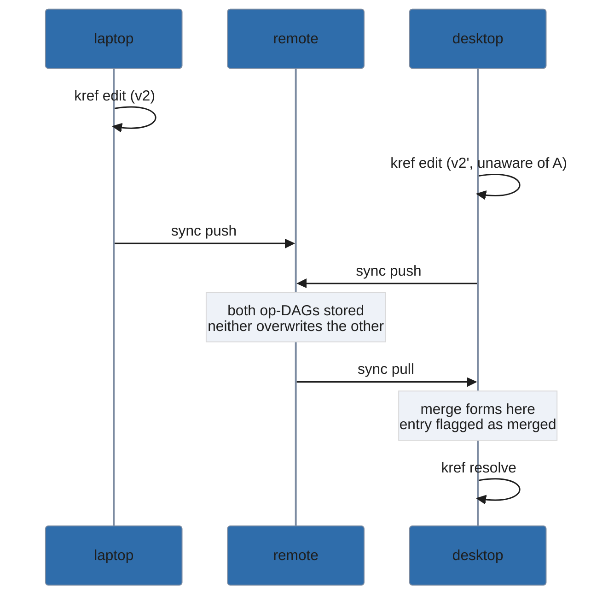
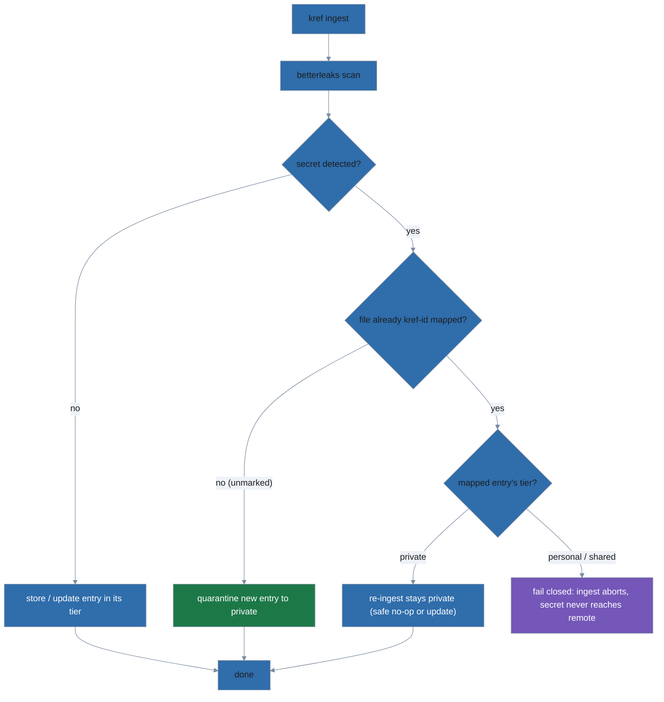

# kref: a repo-resident knowledge base over git objects

[](https://github.com/trevor-vaughan/kref/actions/workflows/test.yml)
[](https://github.com/trevor-vaughan/kref/actions/workflows/lint.yml)
[](https://github.com/trevor-vaughan/kref/actions/workflows/security.yml)
[](https://github.com/trevor-vaughan/kref/actions/workflows/megalint.yml)
[](go.mod)
[](LICENSE)

`kref` stores specs, ADRs, plans, memories, and reference notes inside your git
repository as git objects, under their own ref namespaces — not in your working
tree and not on your `main` branch.

Entry *bodies* travel with the repo (clone, push, pull) without cluttering your file tree, your `git log`, or your `git blame`.

It is built on [git-bug](https://github.com/git-bug/git-bug)'s `entity/dag` framework: every entry is a Lamport-ordered DAG of operations that merges conflict-free across machines and teammates.

> **Status:** 0.1.0, the first tagged release. Local-first CLI. See
> [Limitations](#limitations) and the [CHANGELOG](CHANGELOG.md). A release build
> reports its tag; a build from a working tree reports a short commit SHA
> (suffixed `-dirty` when the tree is modified).

______________________________________________________________________

> 🤖 LLM WARNING 🤖
>
> This project was written with LLM (AI) assistance.
>
> 🤖 LLM WARNING 🤖

______________________________________________________________________

## Demo

**A quick tour**: initialize a store, capture a spec, an ADR, and a private memory across visibility tiers, then list and recall them.


**Secret-aware ingest**: point kref at markdown you already have. One file carries a leaked token; [betterleaks](https://github.com/betterleaks/betterleaks) catches it on the way in and quarantines that entry to the `private` tier, which has no remote and can never be pushed.


<sub>Both demos are rendered with [VHS](https://github.com/charmbracelet/vhs) from the tapes in [`.taskfiles/demo/`](.taskfiles/demo/); regenerate them with `task dev:demo` (needs `vhs`, `ttyd`, and `ffmpeg` on `PATH`).</sub>

______________________________________________________________________

## Why

I was tired of AI agents injecting tons of planning files into my repositories. I also wanted an easy way to keep a running log of issues that I wanted my agents to complete in a way that moved with my repo.

This is very much a work in progress and targeted towards my personal workflow. It is likely to change rapidly for a while.

## What you get

- **Typed entries**:
  - `spec`, `adr`, `plan`, `memory`, `reference`, `document` (free-form `kind`), each with status, links, and author attribution.
- **Three visibility tiers, plus your own**:
  - `private` (never leaves your machine)
    - The private tier is structurally unpushable.
  - `personal` (your devices)
  - `shared` (your team)
  - Any number of custom tiers you declare with `kref tier add`, each with its own remote.
- **Conflict-free sync**: push/pull each tier to a configured remote.
- **Secret-aware ingest**: markdown is scanned with [betterleaks](https://github.com/betterleaks/betterleaks) on the way in
  - Anything that trips a rule is quarantined to the `private` tier.
- **Two-way file tracking**:
  - `track` a markdown file and keep it synced with its entry, in either direction, without committing the file.
- **Git-native excision**:
  - Soft-delete (tombstone) or hard `purge`.

______________________________________________________________________

## Install

Every path below also needs the
[betterleaks](https://github.com/betterleaks/betterleaks) binary: it backs
kref's secret gate, and without it scanning is unavailable. kref looks for it in
`KREF_BETTERLEAKS`, then next to the `kref` binary itself, then on your `PATH` —
so keeping the two binaries in the same directory is enough.

### Download a release

Archives for linux, macOS, and Windows (amd64 and arm64) are attached to every
[release](https://github.com/trevor-vaughan/kref/releases), alongside a
`checksums.txt`, an SBOM, and a build-provenance attestation (see **Releases &
supply chain** below).

```bash
tar -xzf kref_<version>_linux_amd64.tar.gz
install -m 0755 kref ~/.local/bin/   # any directory on your PATH
kref --help
```

### go install

Builds `kref` alone, so install `betterleaks` next to it:

```bash
go install github.com/trevor-vaughan/kref/cmd/kref@latest
go install github.com/betterleaks/betterleaks@latest
```

### Build from source

**Prerequisites:** [Go](https://go.dev/dl/) ≥ 1.26.7 and
[Task](https://taskfile.dev/installation/) (the build runner). Step 2 installs a
pinned `betterleaks` for you.

**1. Clone the repository.**

```bash
git clone https://github.com/trevor-vaughan/kref.git && cd kref
```

**2. Install the pinned tools** (betterleaks, ginkgoleaf, golangci-lint,
govulncheck) into `./bin`:

```bash
task dev:tools
```

**3. Build the binary** into `./bin/kref`:

```bash
task build
```

**4. Put it on your `PATH`.** This makes the examples below (which call a bare
`kref`) runnable, and puts the pinned `betterleaks` alongside it:

```bash
export PATH="$PWD/bin:$PATH"
kref --help
```

Add that `export` line to your shell profile to persist it.

<details>
<summary><strong>Releases &amp; supply chain</strong></summary>

Tagged releases are built in CI by GoReleaser, from a tree that has passed the
same quality gate a pull request must pass. Builds are reproducible: file
modtimes and the embedded date come from the commit, not the clock, so
rebuilding a tag yields byte-identical binaries.

Each release carries cross-compiled archives (linux/darwin/windows on amd64/arm64), a `checksums.txt`, an SPDX SBOM per archive (syft), a keyless [cosign](https://github.com/sigstore/cosign) signature over `checksums.txt`, and a Sigstore build-provenance attestation covering every published file.

**Verify provenance** — that a file was built by this repo's release workflow:

```bash
gh attestation verify kref_<version>_linux_amd64.tar.gz --repo trevor-vaughan/kref
```

**Verify the signature** — `checksums.txt` is signed keylessly, so one check
authenticates every artifact listed in it. No key distribution is involved; the
identity is the release workflow itself:

```bash
cosign verify-blob checksums.txt \
  --bundle checksums.txt.sigstore.json \
  --certificate-identity-regexp '^https://github\.com/trevor-vaughan/kref/' \
  --certificate-oidc-issuer https://token.actions.githubusercontent.com

# then check your download against the now-trusted checksum list
sha256sum --ignore-missing -c checksums.txt
```

</details>

______________________________________________________________________

## Quickstart

**Set up the store** in any git repo:

```bash
cd your-project
kref init                   # adopts your git identity; auto-binds shared → origin if present
```

**Get your existing notes in.** This is the 90% path: each file becomes an entry
(kept out of your working tree), with a `kref-id` trailer written back so
re-ingesting is idempotent.

```bash
kref ingest docs/           # a whole tree (or one file: kref ingest docs/notes.md)
kref track docs/note.md     # keep one file two-way synced
```

**Or compose an entry by hand** when there is no file:

```bash
kref new --kind spec --body $'# Auth design\n\nprose...' --label area:auth  # title from H1
```

**Find and read things:**

```bash
kref                        # interactive cockpit over your entries (q quits)
kref list                   # ...or a static list across tiers (add --tier to filter)
kref search auth            # recall by a title/body substring, with match counts
kref show <id>              # view one — rendered and paged; --plain for the stored body
kref show                   # ...or omit the id to see the most-recently-touched entry
```

**Change things:**

```bash
kref edit <id>              # revise the body in your editor
kref comment <id> -q -m "…" # thread a comment; -q marks a question, --resolve closes it
kref status <id> accepted   # move it through open|active|accepted|superseded|obsolete
kref rm <id>                # soft-delete (tombstone; undo with kref restore)
```

**Optionally, wire it into git.** This takes two steps — kref writes the config,
[lefthook](https://lefthook.dev) activates it — and skipping the second leaves
the hooks dormant:

```bash
kref hooks install          # writes .lefthook.yml (re-ingest changed markdown on commit, …)
lefthook install            # REQUIRED: registers those hooks into .git/hooks
```

`kref list` prints a header and a color-coded visibility-tier column so you can
see at a glance what is private vs shared:

```text
TIER        ID            KIND    STATUS  TITLE
● private   d22bdbc58f3f  memory  open    API key location
◐ personal  4179f614a5b3  adr     open    Use Postgres
○ shared    50ca0294f77e  spec    open    Auth flow spec

3 entries
```

Every command that prints results takes the global `--json` (machine objects) or `--plain` (chrome-free, line-oriented for `grep`/`cut`/`xargs`) flag. The interactive cockpit is the one exception: a TUI cannot honour a machine contract, so bare `kref --json` tells you to use `kref list --json` instead.

`list`, `search`, and `show` have rich terminal rendering, paging, sorting, and column control.

See **[the usage reference](docs/usage.md)** for full details.

> Dogfooding: For a truly quick start, try it out in this repo!


______________________________________________________________________

## Concepts

### Entries and tiers

An entry is a typed record (`--kind`, default `document`) with:

- a title
- an optional markdown body
- a status
- typed links
- author attribution

Each entry lives in one **tier**:

- `private` (never leaves the machine)
- `personal` (your remote only)
- `shared` (the team remote)
- [custom tiers](docs/usage.md#custom-tiers)

`kref retier` moves an entry between tiers without changing its id.

See [tiers and visibility](docs/usage.md#tiers-and-visibility) for full details

### Attribution & provenance

Every entry records who created it (`kref init` adopts your git identity; override per shell, per repo, or globally without re-running `init`).

Every `new`/`ingest` also appends an append-only origin event (actor, human-vs-agent, source path) that `kref show` surfaces.

Operations are attributed but not cryptographically signed. Attribution is currently forgeable — follow [git-bug issue #130](https://github.com/git-bug/git-bug/issues/130) for more information.

See [Attribution](docs/usage.md#attribution) · [Provenance](docs/usage.md#provenance) for details.

### History & divergence

Edits never overwrite irrecoverably: every body edit is retained in the
operation DAG.

- `kref log` shows the numbered version timeline
- `kref diff` renders what changed between versions

When the same entry is edited on two machines and synced, kref forms a conflict-free merge and flags it `◆ merged` until you `kref resolve` it. Nothing is lost; nothing is silent.

The merge forms on **pull**, not on push, and both edits survive it — the flag
asks you to confirm the result, not to pick a winner:


```mermaid
%%{init: {'theme': 'base', 'themeVariables': {
  'primaryColor': '#2f6dab',
  'primaryTextColor': '#1e1e1e',
  'primaryBorderColor': '#7c8ba1',
  'lineColor': '#7c8ba1',
  'edgeLabelBackground': '#eef2f8',
  'tertiaryColor': 'transparent',
  'tertiaryTextColor': '#7c8ba1',
  'tertiaryBorderColor': '#7c8ba1',
  'clusterBkg': 'transparent',
  'clusterBorder': '#7c8ba1',
  'titleColor': '#7c8ba1',
  'noteBkgColor': '#eef2f8',
  'noteTextColor': '#1e1e1e',
  'fontFamily': 'system-ui, sans-serif'
}, 'themeCSS': '.node .nodeLabel{color:#ffffff!important;fill:#ffffff!important;}'}}%%
sequenceDiagram
  participant A as laptop
  participant R as remote
  participant B as desktop
  A->>A: kref edit (v2)
  B->>B: kref edit (v2', unaware of A)
  A->>R: sync push
  B->>R: sync push
  Note over R: both op-DAGs stored<br/>neither overwrites the other
  R->>B: sync pull
  Note over B: merge forms here<br/>entry flagged as merged
  B->>B: kref resolve
```

See [History & divergence](docs/usage.md#history--divergence) for details.

### Hygiene & consolidation

`kref` is built to be written to freely and gardened periodically.

- `kref list` hides `superseded` entries and collapses duplicate titles
- `kref tidy` clusters likely-redundant entries
- `kref archive` retires entries without deleting
- `kref supersede`/`kref link` express relationships

See [Hygiene & consolidation](docs/usage.md#hygiene--consolidation) for details.

### Ingest & file tracking

`kref ingest <dir>` will recursively ingest markdown within the target directory. It can also target non-markdown plain-text files.

All material ingested will be scanned for secrets and stored as entries. Markdown gets a `kref-id` trailer written back so re-ingestion is idempotent.

`kref track` will keep a file and its entry in sync over time. `kref reconcile` will pull file edits and `kref reconcile --write` will push entry edits.


```mermaid
%%{init: {'theme': 'base', 'themeVariables': {
  'primaryColor': '#2f6dab',
  'primaryTextColor': '#1e1e1e',
  'primaryBorderColor': '#7c8ba1',
  'lineColor': '#7c8ba1',
  'edgeLabelBackground': '#eef2f8',
  'tertiaryColor': 'transparent',
  'tertiaryTextColor': '#7c8ba1',
  'tertiaryBorderColor': '#7c8ba1',
  'clusterBkg': 'transparent',
  'clusterBorder': '#7c8ba1',
  'titleColor': '#7c8ba1',
  'noteBkgColor': '#eef2f8',
  'noteTextColor': '#1e1e1e',
  'fontFamily': 'system-ui, sans-serif'
}, 'themeCSS': '.node .nodeLabel{color:#ffffff!important;fill:#ffffff!important;}'}}%%
flowchart TD
  ingest["kref ingest"]
  scan["betterleaks scan"]
  ingest --> scan
  scan --> secret{"secret detected?"}
  secret -->|no| store["store / update entry in its tier"]
  store --> done["done"]
  secret -->|yes| marked{"file already kref-id mapped?"}
  marked -->|"no (unmarked)"| quarantine["quarantine new entry to private"]
  quarantine --> done
  marked -->|yes| tier{"mapped entry's tier?"}
  tier -->|private| safe["re-ingest stays private (safe no-op or update)"]
  safe --> done
  tier -->|"personal / shared"| failclosed["fail closed: ingest aborts, secret never reaches remote"]
  classDef sysA fill:#2f6dab,color:#ffffff,stroke:#7c8ba1
  classDef sysB fill:#1d7848,color:#ffffff,stroke:#7c8ba1
  classDef sysC fill:#7457b8,color:#ffffff,stroke:#7c8ba1
  class store,safe sysA
  class quarantine sysB
  class failclosed sysC
```

See [The ingest bridge](docs/usage.md#the-ingest-bridge) · [Tracking files](docs/usage.md#tracking-files) for details.

### Sync

Tiers map to git remotes via local git config. `kref sync push`/`pull` move
tiers to and from their remotes.

Push is a secret boundary: it scans the delta about to leave and fails closed on a hit, before the remote is ever contacted. You choose where each tier syncs (the project repo, a separate restricted repo, a personal mirror, a bare repo on a NAS). Any git target is fair game.

See [Sync](docs/usage.md#sync) · [Backup & recovery](docs/backup-recovery.md) for details.

### Agents: MCP & instructions

`kref mcp` runs a [Model Context Protocol](https://modelcontextprotocol.io) server over stdio, exposing a curated set of agent tools (including `kref_patch`, the MCP-only unified-diff editor) over the same store the CLI uses.

`kref agents_md` prints a policy block for your global `AGENTS.md` / `CLAUDE.md` so agents route plans and specs into kref instead of dumping files into your tree.

See [MCP server](docs/agents.md#mcp-server) · [Agent instructions](docs/agents.md#agent-instructions) for details.

### Configuration & hooks

`kref` reads two config layers (a machine-local user file then a shared project entry) with a deliberate, local then project, trust model.

[Favorites](docs/usage.md#configuration--favorites) give an entry a memorable name.

Optional [lefthook](https://lefthook.dev) hooks couple kref to git's lifecycle (pull on merge, scan-and-push on push, ingest changed markdown on commit).

See [Configuration & favorites](docs/usage.md#configuration--favorites) · [Hooks](docs/usage.md#hooks) for details.

______________________________________________________________________

## Full reference

The exhaustive command-and-flag list lives in the binary — `kref help` prints a
concise grouped list on a terminal and the full recursive tree when piped (force
it with `kref help --long`). The [usage reference](docs/usage.md) covers what
help can't: the reasoning and cross-command workflows, including
[global flags & the JSON/exit-code contract](docs/usage.md#global-flags--output-contracts),
[shell completion](docs/usage.md#shell-completion), and
[uninstall](docs/uninstall.md).

______________________________________________________________________

## Limitations

This is early software at 0.1.0; some things are deliberately deferred (see [`docs/dev/`](docs/dev/README.md), and the design spec that lives in kref's own store — `kref list --kind spec` after building):

- **No cryptographic signing.** Operations are attributed by git identity but unsigned: git-bug v0.10.1 exposes no API to equip an identity with a signing key. Attribution is therefore forgeable.
- **No encryption at rest.** The `private` tier stays local but is not encrypted on disk.
- **No semantic search.** A derived vector index is planned, not built.

______________________________________________________________________

## Development

See [`docs/dev/`](docs/dev/README.md) for architecture and how the pieces fit; the design specs and implementation plans live in kref's own knowledge base (that being the point of the tool), reachable with `kref list --kind spec` once you have built it. Common tasks are aliased at the root (`task --list` shows everything):

```bash
task dev:tools     # pinned betterleaks, ginkgoleaf, golangci-lint, govulncheck into ./bin
task test          # full Ginkgo suite (task test MODE=llm for errors-only)
task lint          # go vet + gofmt check + golangci-lint (same pin as CI)
task build         # ./bin/kref with embedded version
task dev:test:e2e  # unit + end-to-end suites (slower)
task check         # fmt + lint + vuln + e2e under -race -shuffle
task dev:demo      # re-render the README demo GIFs into docs/demo (needs vhs, ttyd, ffmpeg)
task clean         # remove ./bin, the built binary, and .test-output
task deps:upgrade  # bump module deps to latest minor/patch, then tidy + verify
```

______________________________________________________________________

## License

[GPL-3.0](LICENSE), inherited from git-bug, which `kref` links against.
