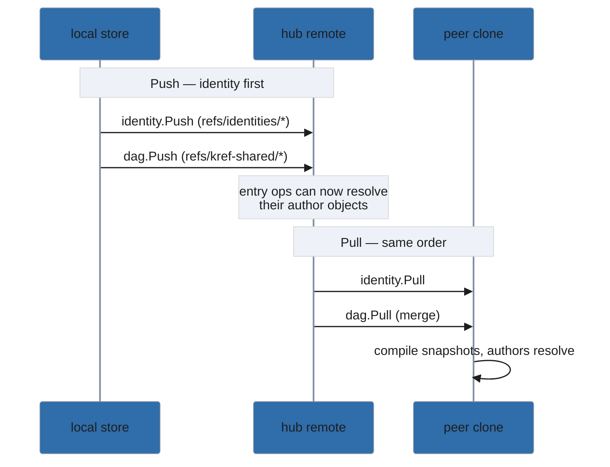

# kref — developer / maintainer documentation

This directory is the maintainer's map of `kref`. User-facing docs live in the
top-level [`README.md`](../../README.md); this explains **how it works** and
**why it's shaped this way**.

The design specs and implementation plans no longer live as files in this tree
— they live in `kref`'s own knowledge base, because that is exactly what `kref`
is for: planning material belongs in git refs, not the working tree. Browse them
with the tool itself:

```bash
kref list --kind spec        # the architecture design and the per-feature designs
kref list --kind plan        # the task-by-task implementation plans
kref show <id>               # read one (use the id from the list)
```

> **You need a built binary and the entry refs to read any of this.** Build with
> `task build` (see the [README](../../README.md#install)). Entries live under
> `refs/kref-*/*`, which a default `git clone` does **not** fetch, so a fresh
> clone starts empty. Pull them with the tool:
>
> ```bash
> kref init          # binds the shared tier to origin, if it is not bound yet
> kref sync pull     # fetches the shared entries (and their author identities)
> ```

- **Architecture design:** the `spec` titled *Git-Native Knowledge Base —
  Architecture Design* holds the architecture, the key decisions (D1–D6), and
  the deferred list. The other `spec` entries capture one feature's design each
  (idempotent marker-based ingest, the unified entry model, the UX slices).
- **Implementation plans:** the `plan` entries are the task-by-task plans the
  code was built against, from Phase 1 (core store) and Phase 2 (sync) through
  the later feature slices.

> Four phase plans embed example AWS tokens as illustrations of the
> secret-scanning they describe. Ingest quarantined those to the unpushable
> `private` tier when they were added; the rest are `shared`. List them with
> `kref list --tier private`. (Note: the current scanner, betterleaks, filters
> synthetic AWS keys, so a re-ingest would not re-quarantine them — they remain
> private because tier assignment is sticky.)

## Reading the spec citations

Sections below cite the architecture design by number — spec section 4.1, spec
section 11, and so on. Those numbers are **sections inside the
architecture-design `spec` entry**, not files in this repository, so there is
nothing to click. To follow one:

```bash
kref list --kind spec                    # find "Git-Native Knowledge Base — Architecture Design"
kref show <id>                           # open it, then press / and type the section number
```

## Substrate

`kref` is a thin domain layer over git-bug's `entity/dag` framework
(`github.com/git-bug/git-bug`, GPL-3.0, pinned at `v0.10.1`). git-bug gives us,
for free:

- entities stored as a Lamport-ordered DAG of operations under
  `refs/<namespace>/<id>`;
- conflict-free merge across clones, with identity/attribution;
- push/pull/fetch over git remotes.

We do **not** fork git-bug — we depend on its public `entity/dag`, `identity`,
and `repository` packages. The single source of truth is the git-object op-DAG;
any query surface (today an in-memory index; possibly SQLite later) is a
derived, rebuildable projection. See [spec §4.1](#reading-the-spec-citations).

## Layout

```text
cmd/kref/             cobra CLI: main.go wires the command tree and global flags;
                      commands.go holds most implementations, with the interactive
                      surfaces split out (viewer.go, listcockpit.go, todo.go,
                      quarantine.go, comment.go, …)

core
internal/entry/       the dag entity: Snapshot, operations, Definition, Compile, Read
internal/store/       Store over the repo: init/open, identity, add/get/list/tombstone,
                      purge (store.go), per-tier remotes + sync (sync.go), and the
                      quarantine queue (quarantine_*.go)
internal/config/      user + project configuration: schema, defaults, layering

write policy (the secret boundary)
internal/scan/        betterleaks shell-out (Scan([]byte) -> []Finding)
internal/entryguard/  secret policy for an entry-body write
internal/commentguard/ secret policy for a comment write
internal/todoguard/   write-boundary policy for kind:todo entries (the version CAS)

content
internal/content/     classifies and validates entry body content types
internal/outline/     markdown body -> ATX-heading tree (drives fold navigation)
internal/textdiff/    dependency-free line diff between two bodies
internal/textpatch/   applies unified diffs to a body (backs kref_patch)
internal/todo/        the todo document model: parse, lint, format, cockpit view

presentation
internal/render/      pure human-readable presentation of entries (no TTY/--json logic)
internal/tui/         shared bubbletea widgets (ScrollView) behind every viewer

integration
internal/bridge/      ingest (scan -> quarantine -> store) + .gitignore guard
internal/hooks/       lefthook config renderer
internal/mcpserver/   thin MCP adapter over the store (curated agent tools)

support
internal/buildinfo/   the build identity `kref version` reports
internal/watermark/   per-identity record of the body a human last saw
internal/xdg/         XDG base-directory resolution ($HOME-side paths)
```

### How an entry works

Every entry is the *same* dag entity regardless of its kind — **kind is a field
set by an operation** (`SetKind`), not a separate type. What does vary per entry
is the **tier**, because the tier selects the ref namespace the entity is stored
under.

An entry is a sequence of **operations**, each embedding `dag.OpBase` and
implementing `Apply(*Snapshot)`:

- lifecycle: `Create`, `SetStatus`, `Tombstone`, `Restore`, `Archive`,
  `Unarchive`
- content: `SetBody`, `SetTitle`, `SetKind`, `SetContentType`
- metadata: `AddLabel`, `RemoveLabel`, `AddLink`, `RemoveLink`
- file tracking: `Track`, `Untrack`
- provenance: `RecordOrigin`, `Reattribute`, `AckMerge`
- comments: `AddComment`, `EditComment`, `DeleteComment`, `ResolveComment`,
  `UnresolveComment`

`Entry.Compile()` folds the ops into a `Snapshot`. Tiers are `entry.Tier` values
whose `Namespace()` is `kref-<tier>`.

**A caveat on `AllTiers()`.** `entry.AllTiers()` returns the three *built-in*
tiers only. It drives the operations that must know the tier set up front — the
lamport-clock loaders registered at open time, for instance — but it is no longer
the whole picture: custom tiers (declared via `kref tier add`, stored in git
config) are witnessed after open by `witnessTierClocks`, and the reserved
`entry.TierQuarantine` sits outside it entirely. When adding tier-aware code,
check whether you need the built-ins or every declared tier
(`Store.Tiers()`).

### Adding a new operation

1. Add an `OperationType` const and a struct embedding `dag.OpBase` in
   `internal/entry/operations.go`, with `Id()`, `Validate()`, `Apply(*Snapshot)`.
2. Register it in `operationUnmarshaler`.
3. Add a constructor `New…(author, …)` and a `Store`/CLI entry point if needed.

## Sync model

Tiers map to remotes via local git config `kref.remote.<tier>`. `private` is
refused at every layer (`SetRemote`/`Push`/`Pull`/`SyncableTiers`) — it is
structurally unpushable, which is the core security property. `Push` sends the
author **identity** (`identity.Push`) before the entries (`dag.Push`) so authors
resolve remotely; `Pull` does `identity.Pull` then `dag.Pull` (merge). This
identity-before-entries ordering is why hub (shared-origin) sync works.

The ordering is the whole trick, and it is easy to invert by accident: an entry's
operations reference their author by identity id, so if the entry ops land on the
remote before the identity object does, a second clone pulling them cannot
resolve who wrote what.



`private` never appears in this picture by construction — `SyncableTiers` omits
it, so there is no code path that could push it.

## Sensitive data

Defense in depth: ingest scanning (betterleaks) quarantines secrets to `private`;
`rm` is a reversible tombstone (not safe for secrets); `purge` excises locally
(`dag.Remove` + `git gc --prune=now`) and, with `--push`, deletes the ref on the
remote (`git push <remote> --delete`). Purge is irreversible and assume-breach:
a leaked secret that was ever pushed must be rotated.

## Testing

- **Ginkgo v2 + Gomega only.** Each package has one `*_suite_test.go` bootstrap.
- **The `entry` package's specs are black-box `package entry_test`** — Ginkgo
  dot-imports an `Entry` identifier that collides with our `entry.Entry` type.
  All other packages are white-box.
- Sync is tested with **real multi-repo round-trips** (peer-to-peer and a bare
  origin proving identity propagation), not stubs.
- Run via `task test` (it provisions a pinned betterleaks and wires `KREF_BETTERLEAKS`).

## Known limitations / deferred

- **No cryptographic signing.** git-bug v0.10.1 exposes no public API to equip
  an identity with a signing key and cannot use system GPG/gpg-agent.
  [Spec §10, §11](#reading-the-spec-citations). Attribution is
  git-identity-based and unsigned.
- **No encryption at rest** for the private/personal tiers
  ([spec §11](#reading-the-spec-citations)).
- **No vector index / semantic search** yet
  ([spec §11](#reading-the-spec-citations)).
