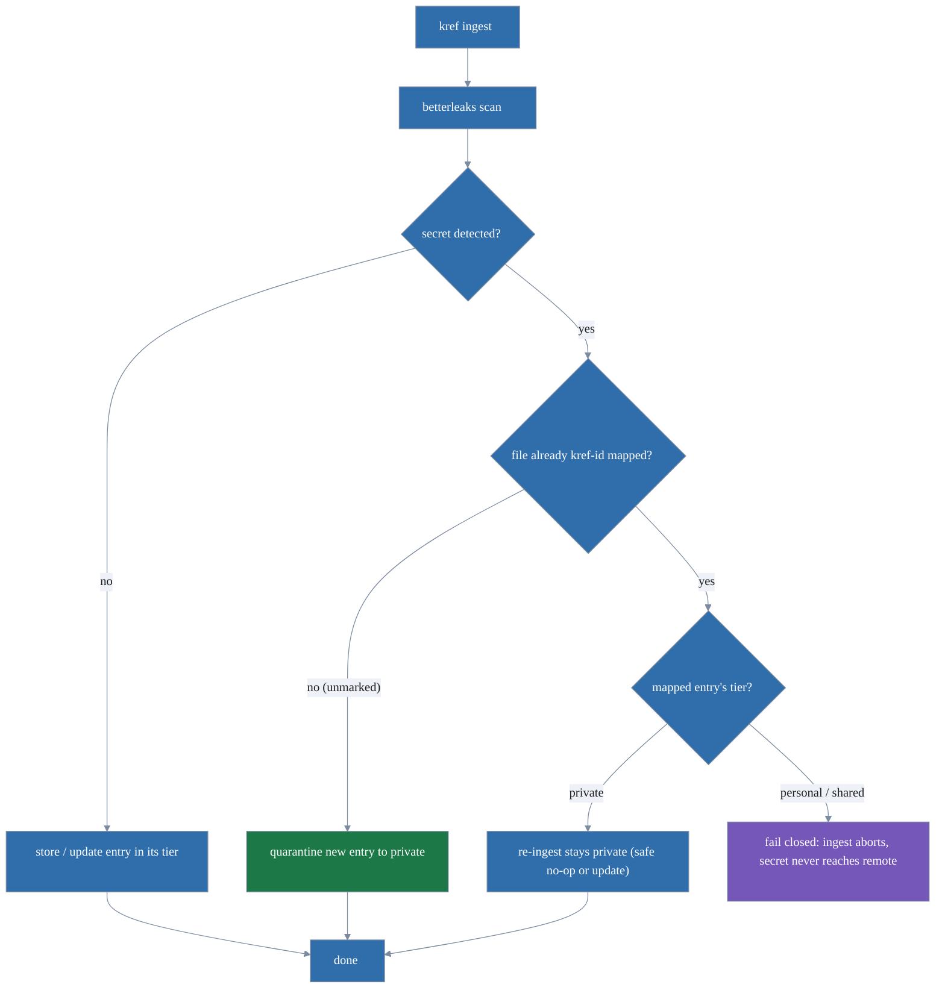

# kref usage reference

The complete command, flag, and behavior reference for `kref`. For an overview,
install steps, and a quickstart, start with the [README](../README.md). This
document is the deep end: every output mode, every flag, every edge case.

The reference of record for command shapes is the binary itself — `kref help`
adapts to context (concise on a terminal, the full recursive tree when piped),
and `kref help --long` prints everything regardless. This page mirrors that
tree and adds the prose that does not fit in `--help` output.

## Contents

- [Global flags & output contracts](#global-flags--output-contracts)
- [Command reference](#command-reference)
- [Creating entries: `new` and `ingest`](#creating-entries-new-and-ingest)
- [Content types](#content-types)
- [`list`: output modes, columns, sorting, paging](#list-output-modes-columns-sorting-paging)
- [`search`](#search)
- [`show`: rendering and paging](#show-rendering-and-paging)
- [Labels](#labels)
- [Tiers and visibility](#tiers-and-visibility)
- [Attribution](#attribution)
- [Provenance](#provenance)
- [History & divergence](#history--divergence)
- [Hygiene & consolidation](#hygiene--consolidation)
- [The ingest bridge](#the-ingest-bridge)
- [Tracking files](#tracking-files)
- [Sync](#sync)
- [Backing up & recovering private knowledge](#backing-up--recovering-private-knowledge)
- [Hooks](#hooks)
- [Configuration & favorites](#configuration--favorites)
- [MCP server](#mcp-server)
- [Agent instructions](#agent-instructions)
- [Shell completion](#shell-completion)
- [betterleaks (runtime dependency)](#betterleaks-runtime-dependency)
- [Deleting things](#deleting-things)
- [Uninstall](#uninstall)
- [Aliases](#aliases)

______________________________________________________________________

## Global flags & output contracts

Four flags are global — accepted by every command:

| Flag             | Meaning                                                                                     |
|------------------|---------------------------------------------------------------------------------------------|
| `--json`         | Machine-readable JSON output (stable, script-friendly shapes)                                |
| `--plain`        | Chrome-free, line-oriented text: TSV for `list`/`search`, the verbatim stored body for `show` |
| `--dir <path>`   | Which repository's ref store to use (see note below)                                        |
| `--actor <name>` | Attribute actions to an agent in the provenance log; absent, the git identity is a human     |

Commands are human-readable by default and switch to JSON under `--json`.
`kref version` follows the same rule: a plain `kref <version>` line by default
(identical to `kref --version`), `{"version": "…"}` under `--json`. (`kref hooks
print` emits its lefthook config directly regardless.)

**Error contract.** Under `--json`, a failure is machine-readable too: the error
is written to stderr as a single-line `{"error": "..."}` envelope (plain
`error: <msg>` without `--json`), so a script never parses two formats. **Exit
status** is `0` on success and `1` on any error.

**`--plain` vs `--json`.** These are the two machine contracts and are mutually
exclusive everywhere — asking for both is a contradiction. `--plain` is
chrome-free, line-oriented, never colored, never paged.

**`--dir` scope.** `--dir` only selects which repository's ref store is used;
file *path arguments* (e.g. `ingest ./notes.md`) are still resolved against your
current working directory, not against `--dir`. By default kref works on the
repo you are in: like git, it walks up from the current directory to the
enclosing repository, so commands work from any subdirectory; outside any repo
it errors cleanly (`.git not found`). If you drive a repo elsewhere via `--dir`,
give path arguments as absolute paths (or `cd` into that repo) so a relative
path is not read — or, for `ingest`, written — under the wrong tree.

**Color.** Auto-detected: on for an interactive terminal, off for pipes and
under `NO_COLOR`. `KREF_COLOR=1` forces it on and `KREF_COLOR=0` forces it off,
overriding both (handy for recording demos, or colorizing a pipe into a pager).
`--json` output is never colored.

**Help depth.** `kref help` and `kref --help` adapt to where output goes. On an
interactive terminal you get the concise, grouped command list. When stdout is a
pipe or redirect (what an automated agent sees), `kref` prints the full
recursive tree: every command and subcommand, their flags and examples, plus a
preamble covering the global flags and the JSON / exit-code contract. Force
either depth explicitly on the `help` command:

```bash
kref help --long       # full tree, regardless of terminal (alias: -l)
kref help --short      # concise list, regardless of pipe (alias: -s)
kref help sync --long  # full help scoped to one command's subtree
```

`--long` and `--short` cannot be combined.

______________________________________________________________________

## Command reference

The full command tree — every command, subcommand, flag, and example — is
generated from the binary itself, so it never drifts from the code:

```bash
kref help --long            # the whole tree, regardless of terminal
kref <command> --help       # one command's flags and examples
kref help <command> --long  # ...including its subtree
```

The sections below cover what `--help` cannot: the reasoning, the workflows, and
the cross-command behavior. A few facts that are *not* obvious from the flag
listing:

- **`kref edit`** resolves its editor in order from `KREF_EDITOR`, then
  `VISUAL`, then `EDITOR`, falling back to `vi`. The value is split on spaces,
  so `KREF_EDITOR="code --wait"` works.

______________________________________________________________________

## Creating entries: `new` and `ingest`

Two ways to create an entry:

- **`kref new`** composes a single entry from flags, for when there is no file:
  ```bash
  kref new --kind spec --body $'# Auth design\n\nprose...' --label area:auth  # title from H1
  kref new --content-type application/json --title "Config schema" --body '{"k":"v"}'
  ```
  The title is derived from the body's H1 if `--title` is omitted. Entries
  default to the `personal` tier; pass `--tier`.

- **`kref ingest <path>...`** imports files you already have. A directory
  argument is walked recursively for `*.md` only; to ingest a non-markdown file,
  name it explicitly. See [The ingest bridge](#the-ingest-bridge) for the full
  secret-handling and content-type behavior.

`--kind <kind>` sets the kind on new entries (default `document`).

______________________________________________________________________

## Content types

Entries carry a MIME content type (default `text/markdown`). Set it at creation
with `kref new --content-type <type>` or change it later with `kref update
--content-type <type>`. `kref ingest` detects the type from the file extension.

Supported types include `text/markdown`, `text/plain`, `application/json`,
`application/yaml`, `application/toml`, `text/x-go`, `text/x-python`,
`text/x-shellscript`, `text/javascript`, and `text/x-typescript`. The
`content_type` field appears in `--json` output from `show` and `list`.

Rendering follows the type: markdown is rendered and reflowed, recognized code
and structured text is syntax-highlighted, everything else prints verbatim (see
[`show`](#show-rendering-and-paging)).

______________________________________________________________________

## `list`: output modes, columns, sorting, paging

`kref list` prints a header and a color-coded visibility-tier column:

```text
TIER        ID            KIND    STATUS  TITLE
● private   d22bdbc58f3f  memory  open    API key location
◐ personal  4179f614a5b3  adr     open    Use Postgres
○ shared    50ca0294f77e  spec    open    Auth flow spec

3 entries
```

Tiers are colored (private = red `●`, personal = yellow `◐`, shared = green
`○`); the glyph prints even with `NO_COLOR` or when piped, so the signal never
depends on color alone. Filter with `--tier`, `--kind`, `--status`, and
`--label` (repeatable, AND).

### Three output modes

| Mode          | What it is                                                             |
|---------------|-----------------------------------------------------------------------|
| default table | Human-readable, colored, collapsed clean view                         |
| `--json`      | Full objects, uncollapsed, the precise-timestamp path                 |
| `--plain`     | Tab-separated, header-less, color-less, one row per match, for shells |

`--plain` is a global flag with one meaning everywhere (chrome-free,
line-oriented output for `grep`/`cut`/`xargs`), shared by `list`, `search` (TSV
rows), and `show` (the verbatim stored body); on commands with nothing to strip
it is a harmless no-op. On `list`, `--plain` honors every filter and lists each
match uncollapsed, one per line. The common "give me the ids matching this
filter" idiom:

```bash
kref list --tier shared --plain --columns=id | xargs -n1 kref show
```

`--plain` also feeds bulk updates: `kref update` accepts multiple ids (or
`--all`), so you can select with `list --plain` and apply one change to all.
Only `--kind`/`--reset-author`/`--author` bulk-apply (per-entry content flags
stay single-entry); `--all` confirms unless `-y`:

```bash
kref list --kind note --plain --columns=id | xargs kref update --kind reference
```

### Columns

Choose columns with `--columns=a,b,c` (the `=` is required). Available columns:

`tier id fullid kind status title author email created updated edited labels
tracked path source`

where `updated` is the last change of any kind, `edited` the last body change;
`path` is the tracked-file path from `kref track`, `source` the provenance
origin path an entry was ingested from. Run bare `kref list --columns` (no
value) to print the full column list with descriptions. `--wide` (`-w`) is a
preset: `tier,id,kind,status,author,edited,title`.

`--columns` and `--wide` are list-local: not combinable with `--json` (already
the full object) or `--new`, and mutually exclusive with each other. `--plain`
is also not combinable with `--new`.

### Sorting

`--sort <field>` reorders any of the three output modes. Fields: `tier id kind
status title author created updated edited`. Bare keys sort ascending, except
the date fields (`created`, `updated`, `edited`), which put the newest at the
top; append `:asc`/`:desc` to override. The default is `--sort edited`: entries
whose body changed most recently first. `edited` tracks only body edits, so
metadata churn (labels, links, status, retier) does not resurface an entry; use
`--sort updated` for last-touched-by-anything order, or `--sort tier` to group
by visibility. `kref search` takes the same flag plus `matches` (default
`matches:desc`).

### Paging

On an interactive terminal the table opens in a lean pager: the same scrolling
and `/` search as `kref show`, but with no line-number gutter and no `<n>g` line
jumps. Piped or redirected output prints straight through; `--plain` and
`--json` never page; `--no-pager` opts out on a terminal.

### Other flags

- `--all` shows everything (superseded + tombstoned), uncollapsed.
- `--archived` shows only archived entries (tagged `(archived)`).
- `--new` shows what changed since your last sync: *incoming* (from your last
  pull) and *unpushed* (changed since your last push).
- `--include-deleted` includes soft-deleted (tombstoned) entries.
- `--check` flags drifted tracked entries (reads files).

______________________________________________________________________

## `search`

`kref search <query>` finds entries whose title or body contains the query
(case-insensitive) and shows how many times it occurs in each, most matches
first:

```text
MATCHES  TIER        ID            KIND      TITLE
      3  ○ shared    50ca0294f77e  spec      Auth flow spec
      1  ◐ personal  4179f614a5b3  adr       Use Postgres

2 entries, 4 matches
```

It composes with the same `--kind`/`--status`/`--tier`/`--label` filters as
`kref list`, pages on a terminal like `list` does, and under `--json` emits the
full entry objects plus a `matches` field. `kref search <query> --plain` emits
one tab-separated row per hit (matches, tier, id, kind, title) with no header or
footer, for the same `grep`/`cut`/`xargs` pipelines as `list --plain`.

______________________________________________________________________

## `show`: rendering and paging

`kref show` renders entries before printing: the metadata is laid out as an
aligned key/value table, markdown bodies are rendered with a rich terminal
renderer and wrapped to your terminal width, recognized code and structured text
(JSON, YAML, Go, Python, shell, etc.) is syntax-highlighted, and anything else
prints verbatim. Rendered markdown also reflows: soft-wrapped source lines join
back into full-width paragraphs, list items, and blockquotes (LLM-authored
entries typically arrive hard-wrapped at ~78 columns); hard line breaks, code
blocks, and tables are left untouched, and `--plain` returns the exact stored
bytes.

Omit the id to show the most-recently-touched entry. Address an entry by the
file it came from: `kref show ./docs/note.md`.

On an interactive terminal a full-screen pager opens automatically with a
line-number gutter:

| Key                | Action                                                            |
|--------------------|-------------------------------------------------------------------|
| `j`/`k`, arrows    | scroll                                                            |
| `ctrl+d`/`ctrl+u`  | page                                                             |
| `gg`/`G`           | jump to top / bottom                                              |
| `<n>g`             | jump to line *n*                                                  |
| `/`                | search (`n`/`N` for next / previous match)                       |
| `r`                | re-read the entry from the store and re-render in place           |
| `?`                | toggle the key-binding help                                       |
| `q`                | quit                                                              |

`r` is handy when an agent or a sync is updating the entry you are reading. When
output is piped or redirected, paging is skipped.

Three flags control the output:

| Flag               | Effect                                                                                                         |
|--------------------|----------------------------------------------------------------------------------------------------------------|
| `--plain` (global) | emit the stored body verbatim, no header (the redirect/byte-fidelity form): `kref show --plain <id> > note.md` |
| `--no-header`      | omit the metadata block                                                                                        |
| `--no-pager`       | never page, even on an interactive terminal                                                                    |

______________________________________________________________________

## Labels

Labels are a free-form, multi-valued organization axis, orthogonal to the
visibility tier. Attach them at `new` time (`--label`, repeatable), or with
`kref label add|rm <id> <label>...`, and filter with `kref list --label`
(repeatable, AND). Convention: `prefix:value` (e.g. `area:auth`,
`project:kref`). They merge conflict-free across machines and show in `kref
list` (`[…]`) and `kref show`.

______________________________________________________________________

## Tiers and visibility

An entry lives in one **tier**, selected with `--tier`:

| Tier       | Ref namespace          | Leaves the machine?                     |
|------------|------------------------|-----------------------------------------|
| `private`  | `refs/kref-private/*`  | **Never** (no remote can be configured) |
| `personal` | `refs/kref-personal/*` | Only to *your* configured remote        |
| `shared`   | `refs/kref-shared/*`   | To the team's configured remote         |

Entries default to `personal`. Pass `--tier shared` to put an entry on the team
remote, or `--tier private` to keep it on this machine only.

### Custom tiers

Declare your own tier with `kref tier add <name> --type personal|shared
[--remote <name> [--url <url>]]` and it behaves exactly like a built-in of that
type: same ref namespace scheme (`refs/kref-<name>/*`), same sync, same secret
gates; the glyph and color follow the type, the word is your tier name.

Definitions live in machine-local git config (`kref.tier.<name>`), so each clone
declares its own set. Reads *discover* undeclared namespaces from refs (a
teammate's custom tier renders shared-typed instead of vanishing), but writes
into a namespace are refused until you declare it. `kref tier rm` undeclares
(refusing while the tier still holds entries unless `--force`); the refs are
never deleted — the namespace just becomes undeclared and read-only again.
`kref tier list` shows every tier: type, remote, and declared state.

### Retiering

`kref retier <id> <tier>` (alias `mv`) moves an entry between any declared tiers
without changing its id; links, labels, and provenance ride along, and a
`retier` provenance event is recorded. Moving to a shared-typed tier rescans for
secrets (fail-closed), confirms (`--yes` to skip), and warns about links to
entries that stay below shared. Demoting an already-pushed entry warns honestly:
it only stops future local sync and cannot retract what already left.

______________________________________________________________________

## Attribution

`kref init` adopts your git identity (`user.name` / `user.email`); override with
`--name`/`--email`. The creating author is recorded on every entry (`CreatedBy`)
and shown by `kref show`. Operations are attributed but not cryptographically
signed; attribution is forgeable (see the README's Limitations).

You can override the author per shell or per repo without re-running `init`. The
kref author is the *logical* author stamped on entry history; it is independent
of who authors the underlying git objects (those always stay your default git
identity). This matters when kref runs in a container or CI whose git identity
isn't yours but you still want your name on the knowledge. Precedence (highest
first):

1. `KREF_AUTHOR_NAME` + `KREF_AUTHOR_EMAIL` (environment), per shell/container.
1. `kref.author.name` + `kref.author.email` (git config, read merged from
   global + local):
   ```bash
   git config --global kref.author.name  "Your Name"
   git config --global kref.author.email "you@example.com"
   ```
1. The identity baked at `kref init` (the fallback).

Each source must supply both name and email or kref errors; it never mixes a
name from one layer with an email from another. An override is resolved to a
real, sync-resolvable identity (reused if it already exists), so attribution
still propagates on push.

The "who am I" pointer is local and does not travel: the identity baked at
`init` is stored in the repo's *local* git config. Re-running `kref init` does
not change it; it prints the current identity. When you clone a repo from
elsewhere, you inherit none of the origin's identity — you `kref init` as
yourself. Pulled entries keep their *original* authors (authorship travels with
the entry); new entries you create are attributed to you.

The displayed author can be corrected after the fact with `kref update`:
`--reset-author` reattributes it to your current kref identity, `--author "Name
<email>"` to an explicit author. The two are mutually exclusive and need no
other change, so `kref update <id> --reset-author` is valid alone. Reattribution
is an append-only operation authored by *you*, so it shows in `kref log`
(`reattribute`) without rewriting the original `Create`.

______________________________________________________________________

## Provenance

Every `new`/`ingest` appends an append-only origin event (`{actor, actor_kind
(human|agent), source_path, trigger, time}`) surfaced by `kref show` (`Origin:
ingest by claude (agent) from docs/note.md`). Set `--actor`/`KREF_ACTOR` to mark
an agent; otherwise the git identity is recorded as a human (self-asserted, like
the git author: a context signal, not authz). Source paths are stored relative
to the repository root (basename if a file is ingested from outside the repo),
so an absolute local path never reaches the syncable log. Because the kref-id
trailer ties a file to its entry, you can address an entry by the file it came
from: `kref show ./docs/note.md`, `kref restore ./docs/note.md`.

______________________________________________________________________

## History & divergence

Edits never overwrite irrecoverably: every body edit is retained in the
operation DAG.

- **`kref log <id>`** shows the full timeline (who changed what, when); each
  body edit is numbered (`v1`, `v2`, …) and carries a compact change summary
  (`v2  +318/-42 chars, +7/-2 lines`). `--since-pull` shows just the ops you
  added after the last pull.
- **`kref diff <id>`** renders what changed between versions as an inline diff
  (additions green, removals red, unchanged as context): bare, it walks the
  whole chain (`v1`, `v1 → v2`, …); `kref diff <id> 3` shows just what v3
  changed; `kref diff <id> 1 4` spans a range. Pass `--full` for the old
  whole-body view, the recovery path for a body a later edit superseded (copy
  the version out).

### Concurrent merges

When the same entry is edited on two machines and synced, kref forms a merge
commit and flags the entry `◆ merged` in `kref show`/`kref list`. Review the
divergent bodies with `kref diff`, settle on a final body with `kref edit`, then
`kref resolve <id>` to acknowledge the merge and clear the flag. The flag means
"an *unacknowledged* concurrent merge exists": a later divergence re-flags it.
(Acknowledgement is itself synced; if two machines resolve concurrently the
resulting merge re-flags once, so resolve again to settle.) Nothing is lost;
nothing is silent.

______________________________________________________________________

## Hygiene & consolidation

`kref` is built to be written to freely and gardened periodically. The default
`kref list` stays legible: it hides `superseded` entries and collapses entries
that share a normalized title (lowercased, whitespace-folded) into one row
tagged `(×N)`. `kref list --all` shows everything, uncollapsed. The clean view
is a presentation layer only: `kref list --json` always returns the full,
uncollapsed set, so scripts and agents are unaffected.

### Archiving

Archiving retires an entry without deleting it: `kref archive <id>` hides it from
the normal list (its status is preserved, so an `obsolete` entry stays
`obsolete`), `kref list --archived` shows only the archived ones (tagged
`(archived)`), and `kref unarchive <id>` brings it back. `kref archive
--obsolete` archives every obsolete entry in one go, after a confirmation
(`-y`/`--yes` skips it). Unlike `rm`/tombstone, archiving is a pure visibility
flag, not a deletion.

### tidy, links, supersede

`kref tidy` is a read-only review surface that clusters the likely-redundant:
duplicate-title groups, `◆ merged` (diverged) entries, and superseded chains.
Act on a cluster with `kref supersede <old> <new>`, which links the new entry to
the old (`supersedes`) and marks the old one superseded so it drops from the
default list.

Relationships are inspected with `kref links <id>` (incoming and outgoing typed
edges) and `kref tree <id>` (the parent-child hierarchy). For arbitrary
relationships beyond supersede, `kref link add <id> <target> --type depends-on`
creates a generic typed link (free-form `--type`, default `relates`) and `kref
link rm` removes it; links are one-directional (the `kref links` viewer resolves
incoming edges by scanning). Linking a more-public entry to a more-private one
warns that the private entry's id rides along on push but proceeds — the same
warn-not-block stance `kref retier` takes on cross-tier links. Duplicate
detection is exact normalized-title matching; fuzzy and semantic similarity are
deferred to a future search-index tier.

______________________________________________________________________

## The ingest bridge



`kref ingest <path>...` reads file(s), runs a betterleaks scan, and stores each
as an entry. A directory argument is walked recursively for `*.md` only. To
ingest a non-markdown file, name it explicitly (e.g. `kref ingest config.json`).
How a named file is handled depends on its type:

- **Markdown** (`.md`): on the first ingest kref stamps a `<!-- kref-id: … -->`
  trailer into the file; a later ingest of that file updates the same entry
  instead of creating a duplicate (an unchanged file is a no-op). This is the
  only type a directory walk picks up.
- **Other text** (`.json`, `.yaml`, `.go`, `.py`, `.sh`, `.toml`, `.ts`, etc.,
  named explicitly): stored *content-only* with a content type detected from the
  extension: no trailer is written and the file is not tracked. Re-ingest
  creates a new entry each time.
- **Binary**: rejected with an error.

### Secret handling

If a secret is detected in an *unmarked* file the entry is quarantined to
`private`; in an already-mapped file that lives in a syncable tier
(`personal`/`shared`) ingest fails closed, so the secret never reaches that
tier's remote — rotate it and `kref purge <id> --gc`, then re-ingest. A file
already quarantined into `private` is the exception: because `private`
structurally cannot push, re-ingesting it stays safe and re-runnable (unchanged
→ no-op; edited → updates the still-private entry), so re-running `kref ingest
<dir>` over a tree that quarantined a file does not error.

If betterleaks flags prose that is not a real secret (e.g. design notes that
quote a token format), supply a custom config or allowlist via the
`BETTERLEAKS_CONFIG` environment variable (its gitleaks-compatible
`GITLEAKS_CONFIG` is also honored); kref passes the environment through to
betterleaks, so an allowlisted pattern is no longer quarantined. An entry that
was already quarantined into `private` and confirmed a false positive can be
moved out directly with `kref retier <id> shared`; the ingest summary prints
this hint whenever it quarantines a file.

### Kind, scanning surfaces, misc

`--kind <kind>` sets the kind on new entries (default `document`); a re-ingest
with `--kind` re-kinds the entry, while a kind-less ingest leaves an existing
entry's kind untouched, so the kind-less post-commit hook never reverts a kind
set via `kref update --kind` or an earlier `kref ingest --kind`. The same
betterleaks scan guards `kref update --file` (file-sourced bodies); typed
`--body`/stdin content is not scanned. `--skip-missing` skips paths that do not
exist.

Entries live in git refs (`refs/kref-{private,personal,shared}/*`), not on disk.
To keep a file and its entry in sync *after* the first import (rather than
re-running `ingest` by hand), [track it](#tracking-files).

______________________________________________________________________

## Tracking files

`ingest` is one-shot: it imports a file's content, but the file and the entry
then drift independently. Tracking keeps a chosen file and its entry in sync
over time, in either direction.

```bash
kref track docs/note.md      # ingest it, then mark the entry tracked
kref reconcile docs/note.md  # pull: re-read the file into its entry
kref reconcile               # ...or sweep every tracked file (asks to confirm)
```

`kref track <path>` ingests the file and records the link. A file inside the
repo is tracked in place; a *floater* (a path outside the repo) is copied under
`.kref/<name>` and tracked there; the original is never moved. `.kref/` is
ignored locally through `.git/info/exclude` (set up by `kref init`), so it stays
out of the tracked tree without a committed `.gitignore`. `kref untrack
<id|path>` stops syncing and leaves the file on disk.

`kref reconcile` **pulls** (file → entry): it re-reads each tracked file and
updates its entry when the file changed (idempotent; a moved file self-heals via
its trailer, a deleted file is skipped, a secret fails closed unless `--force`).
By default it never writes files. Addressing a tracked file by path resolves it
through its `kref-id` trailer, but falls back to the stored tracked-path mapping
if that trailer is gone (e.g. a markdown formatter stripped the HTML comment),
so the path form works wherever the sweep form does.

`kref reconcile --write` **pushes** the other way (entry → file): when the file
is a safe fast-forward (its content is a past version of the entry), the entry's
body is written back out. If the file has diverged (holds edits the entry never
saw), reconcile prints a unified entry-vs-file diff and refuses, so you can pull
(`reconcile`) or overwrite with `--write --force`. Writing files is the only
destructive direction, so it is opt-in and, in a sweep, gated behind a
confirmation.

Drift is visible without syncing: `kref show` shows a `Tracked  <path>
[in-sync|drifted|missing]` row in the metadata header, `kref list --check` flags
drifted tracked entries, and `kref reconcile --dry-run` reports what would change
(with diffs under `--write`) without touching anything.

______________________________________________________________________

## Sync

Tiers map to git remotes via local git config (`kref.remote.<tier>`). The
private tier can never be given a remote.

```bash
kref remote set shared origin git@github.com:you/team-kref.git
kref remote                    # list every tier's remote (alias: kref remote list)
kref remote get shared         # print one tier's remote; errors when unconfigured
kref sync push                 # push all syncable tiers (private is skipped)
kref sync pull --tier shared   # or one tier
```

Custom tiers sync exactly like the built-ins: wire the remote with `kref remote
set <tier> ...` after the fact, or in one step at declaration time with `kref
tier add <name> --type shared --remote <name> --url <url>`. `kref sync
push`/`pull` iterate every declared tier that has a remote.

Sync moves the author identity alongside the entries, so teammates can resolve
who wrote what. Merges are conflict-free (Lamport-ordered operation DAGs).

### Remote layouts

A tier's remote is an ordinary git remote, so these layouts are all plain git
plumbing; pick per tier, mix freely:

- **`shared` → the project repo itself** (`kref remote set shared origin`).
  Easiest: whoever can pull the code can pull the knowledge; nothing new to
  provision. The flip side: anyone with read access to the repo can read the
  shared tier — right for team-internal projects, wrong if the repo is public.
- **`shared` → a separate, restricted repo** (`kref remote set shared team-kb
  git@github.com:org/project-kb.git`). The knowledge base gets its own (tighter)
  access control. Costs one extra repo to create and grant.
- **`personal` → your own mirror** (`kref remote set personal me
  git@github.com:you/project-notes.git`). Your memories and drafts follow you
  across machines without touching the team's remotes.
- **`personal`/`shared` → a bare repo on a filesystem you already trust**
  (`kref remote set personal vault /mnt/nas/kref/project.git`, after `git init
  --bare` there). No forge account involved: right for air-gapped setups or a
  NAS-backed home lab.
- **`private` → nowhere, ever.** Not a layout choice: the private tier refuses a
  remote by construction. Off-machine safety for it is `kref bundle export` /
  `kref vault backup` (see below).

Whatever the layout, `kref remote` shows the current map at a glance, and
anything already pushed must be treated as disclosed to whoever can read that
remote; moving an entry to a tighter tier later stops *future* syncs — it cannot
retract copies.

### The push secret boundary

`kref sync push` is a secret boundary. Before any content leaves the machine,
push scans the delta about to leave (every body version of each new or changed
entry) with betterleaks, and fails closed on a hit (the push is aborted before
the remote is contacted; the offending entry id and rule are reported, never the
secret value). Because the DAG retains full history, a secret added and later
edited away is still caught; the fix is to rotate it, `kref purge <id> --gc`,
recreate the entry clean, and re-push. A successful push records per-entry
pushed-state (local `refs/kref-pushed/*` bookkeeping that never leaves), so later
pushes re-scan only the new delta.

After syncing, `kref list --new` shows two groups: *incoming* (entries your last
`sync pull` brought from teammates) and *unpushed* (entries you changed since
your last push). `kref log <id> --since-pull` shows just the ops you added to an
entry after the last pull.

______________________________________________________________________

## Backing up & recovering private knowledge

The `private` tier never has a remote, so it lives only in this repo and would
be lost if the repo/disk dies. Two local-only recovery paths fill that gap
(neither ever touches a network remote):

```bash
# Portable bundle — your cross-machine / re-clone path. Keep the file wherever.
kref bundle export --tier private private.bundle
kref bundle import --tier private private.bundle   # into a fresh clone (authors preserved)

# Local vault — same-machine convenience under $XDG_DATA_HOME (not cache).
kref vault backup     # mirror private to ~/.local/share/kref/<repo>/private.bundle
kref vault restore    # bring it back after an rm -rf or a bad purge
```

`bundle export`/`import` take any tier(s) via repeatable `--tier` (default:
all), and read/write `-` for stdin/stdout, so an imported entry keeps its
original author, and you can encrypt a backup by composing with an external
tool:

```bash
kref bundle export --tier private - | age -r AGE_RECIPIENT > private.age
age -d private.age | kref bundle import -
```

Bundles and the vault are unencrypted (the live `.git` refs are too). Native
encryption at rest is a deferred decision, captured as the *Encryption at rest
for the private tier* ADR in kref's own store (`kref list --kind adr`);
candidates are [SOPS](https://github.com/getsops/sops) and
[age](https://github.com/FiloSottile/age).

______________________________________________________________________

## Hooks

Couple kref to git's lifecycle with [lefthook](https://lefthook.dev). lefthook
is not bundled, so install it first (`go install
github.com/evilmartians/lefthook@latest`, or your package manager).

```bash
kref hooks install     # writes/merges .lefthook.yml: post-merge/checkout -> sync pull,
                     # pre-push -> sync push, post-commit -> ingest changed markdown
                     # under docs/superpowers/plans, specs, .specify, openspec.
                     # Hooks call kref by ABSOLUTE PATH; --force MERGES into an
                     # existing .lefthook.yml (your other hooks are preserved).
lefthook install     # REQUIRED: register the hooks into .git/hooks
kref hooks print       # print the config instead of writing it
```

`kref hooks install` only writes `.lefthook.yml` (its output reports `"status":
"written"`); the hooks stay dormant until `lefthook install` registers them into
`.git/hooks`. Run `lefthook install` again after any edit to `.lefthook.yml`.

The generated hooks invoke kref by absolute path (so the hook finds the same
`betterleaks`-sibling binary regardless of the committer's `PATH`). The
trade-off: if you move or reinstall kref to a new path, the registered hooks
point at the old location until you re-run `kref hooks install` (and `lefthook
install`).

Override the watched directories with repeatable `--ingest-path` flags (default:
`docs/superpowers/plans specs .specify openspec`):

```bash
kref hooks install --ingest-path docs/plans --ingest-path adr
```

______________________________________________________________________

## Configuration & favorites

kref reads two config layers, user over project. The user file at
`$XDG_CONFIG_HOME/kref/config.yaml` (usually `~/.config/kref/config.yaml`) is a
sparse override that lives only on your machine. It layers over a shared project
entry, a `kind:config` entry with the reserved name `kref.conf`, found by kind
and synced with whatever tier it lives in. The user file wins key by key;
anything it omits falls through to the project entry, then to built-in defaults.

```bash
kref config              # the effective (merged) config; add --json for a machine-readable object
kref config init         # write the user file template (--force overwrites, backing up to .bck)
kref config init --shared  # instead create the shared kref.conf project entry (--tier picks its tier)
kref config check        # validate the effective config; report schema version and betterleaks status
kref config edit         # edit the user file in $EDITOR, validating before save (visudo-style)
kref config migrate      # migrate the shared kref.conf entry to the current schema
```

The user file auto-migrates on load: an out-of-date file is upgraded in place,
with the original saved to `.bck`. The shared entry never auto-migrates (it is
team-visible state); bring it forward deliberately with `kref config migrate`.

The trust model is deliberate. `trusted_keys` is honored only from the user file
and gates which keys a shared `kref.conf` may set on you, so a teammate cannot
push config you did not opt into. It defaults to `[favorites, warn_unscanned]`;
`scanners` is deliberately not trusted by default, so a shared entry can never
silently reconfigure secret scanning on your machine.

`warn_unscanned: false` silences the "stored UNSCANNED" advisory that appears
when betterleaks is absent. It only quiets the advisory; it never relaxes the
`kref sync push` secret boundary, which always scans and fails closed regardless
of config.

### Favorites

Favorites give an entry a memorable name usable anywhere an id is accepted
(`kref show <name>`, `kref diff <name>`, …). A name must contain a non-hex
character so it can never shadow an id.

```bash
kref fav add a1b2c3d4 todo     # name an entry — id first, so `add <TAB>` completes the entry (alias: kref alt)
kref fav ls                    # list favorites from both layers, tagged (user)/(shared) — also the bare `kref fav`
kref show todo                 # resolve the favorite anywhere an id goes
kref fav rm todo               # remove it (`rm <TAB>` completes existing favorite names)
kref fav add a1b2c3d4 release --shared   # write to the shared kref.conf entry (which must already exist)
```

Favorites default to your user file; `--shared` (on `add`/`rm`) reads and writes
the shared `kref.conf` project entry instead, so the whole team resolves the
same name; create it first with `kref config init --shared`.

______________________________________________________________________

## MCP server

`kref mcp` runs a [Model Context Protocol](https://modelcontextprotocol.io)
server over stdio, exposing a curated set of agent tools over the same store the
CLI uses: `kref_remember`, `kref_recall`, `kref_get`, `kref_update`,
`kref_patch`, `kref_lifecycle`, `kref_supersede`. `kref_lifecycle` covers the
reversible document lifecycle (set_status, delete/restore via tombstones,
archive/unarchive); `purge` (irreversible) and `retier` (a disclosure-sensitive
move) are deliberately not exposed to agents.

`kref_patch` is the agent editor, and it is deliberately MCP-only (no CLI
equivalent; a human edits with `kref edit`): it applies a standard unified diff
to the entry body, the format LLMs emit natively. The applier is lenient where
models are sloppy and strict where safety demands it: hunk line numbers are
hints only (each hunk is located by its context lines, matched exactly or up to
trailing whitespace, and hunks apply in document order), while a hunk whose
context is missing (stale diff) or ambiguous (identical sections, no usable line
hint) fails loudly, all-or-nothing, so a patch never half-applies or silently
lands in the wrong place. Each successful patch is one new body version.

Point an agent host at it per repo:

```json
{ "mcpServers": { "kref": { "command": "kref", "args": ["--dir", "/path/to/repo", "mcp"] } } }
```

Shell-capable agents mostly don't need it (they already have `--json` on every
command), but `kref_patch` is the exception worth wiring in: fine-grained edits
exist only on the MCP surface. MCP writes are recorded as agent provenance.

______________________________________________________________________

## Agent instructions

`kref agents_md` prints a canonical policy block for your global
`AGENTS.md`/`CLAUDE.md`, the instruction layer that outranks skills, so it can
override other skills' file-writing defaults (plans, specs, and handoffs become
kref entries instead of worktree files). `kref agents_md --skill` emits a
complete `SKILL.md` driving manual for skill-loading agent hosts. The text ships
in the binary, so it always matches the installed version's commands; regenerate
after upgrades:

```bash
kref agents_md >> ~/.claude/CLAUDE.md   # or your global AGENTS.md
kref agents_md --skill > ~/.claude/skills/kref/SKILL.md
```

______________________________________________________________________

## Shell completion

Print the completion script for your shell, or write it straight to the shell's
standard completion directory with `--install`:

```bash
kref completion bash --install   # ~/.local/share/bash-completion/completions/kref
kref completion zsh  --install   # ~/.local/share/zsh/site-functions/_kref  (must be on fpath)
kref completion fish --install   # ~/.config/fish/completions/kref.fish
```

Without `--install` the script goes to stdout. `--install` honors
`$XDG_DATA_HOME`/`$XDG_CONFIG_HOME`; pass `--dir <path>` to write somewhere else
(handy for a zsh `fpath` that omits the default). For zsh, `--install` also
prints the `fpath` line to add when the directory is not already on it. kref
never edits your shell rc files. PowerShell is print-only; add the output to
your `$PROFILE`.

Once installed, completion knows what each command takes, so a `<TAB>` offers the
right thing instead of a stray directory listing:

- **Entry ids** on every command that takes one (`show`, `rm`, `edit`, `update`,
  `log`, `diff`, `status`, `retier`, `supersede`, `link`, …), listing each id
  beside its title. `restore` offers only soft-deleted entries and `unarchive`
  only archived ones. Typing a `/` or `.md` prefix completes file paths instead.
- **Fixed vocabularies** where they apply: `kref status <id> <TAB>` → `open
  active accepted superseded obsolete`; `kref retier <id> <TAB>` and `--tier` →
  `private personal shared`.
- **Your own values** for `--kind` and `--label`, drawn from the entries in your
  store. `kref ingest --kind <TAB>` and `kref track --kind <TAB>` do the same,
  falling back to `document` in a fresh store.
- **Command aliases** as first-word completions: `kref imp<TAB>` offers
  `import`, and a bare `kref <TAB>` lists aliases like `ls`, `cat`, `new`.
- **Column names** for `kref list --columns=<TAB>`, comma-aware: after
  `--columns=id,<TAB>` it offers the remaining columns and keeps the cursor in
  place for chaining. Use the `=` form: a bare `--columns` means "list the
  available columns".

Commands that take no argument (`list`, `new`, `tidy`, `sync push`, …) complete
their flags rather than falling back to a file listing.

______________________________________________________________________

## betterleaks (runtime dependency)

kref uses [betterleaks](https://github.com/betterleaks/betterleaks) as its
secret scanner: a drop-in successor to gitleaks by gitleaks' original author,
sharing its v8 report schema and CLI flags. The `ingest` and `sync push` paths
shell out to `betterleaks` (on the way in, and on the delta about to leave).
`task test` provisions a pinned betterleaks into `./bin` via its `dev:tools`
dependency and points kref at it through `KREF_BETTERLEAKS` (run `task dev:tools`
directly to provision it for a plain `task build`).

At runtime, kref resolves betterleaks in order:

1. `KREF_BETTERLEAKS` (if set).
1. A `betterleaks` next to the kref binary (so the source build's `./bin/kref` +
   `./bin/betterleaks` layout works with no extra setup, as do the lefthook
   hooks, which call kref by absolute path).
1. `betterleaks` on `PATH`.

Pin version: `BETTERLEAKS_VERSION` in `Taskfile.yml`.

kref forwards its environment to betterleaks, so a custom config `.toml` (which
can carry an `[allowlist]`) set via `BETTERLEAKS_CONFIG` (or its
gitleaks-compatible `GITLEAKS_CONFIG`) is honored for both the `ingest` and
`sync push` scans: the escape hatch for prose that trips a rule without being a
real secret.

When betterleaks cannot be found, kref degrades by surface rather than failing
everything: `ingest`, `track`, `reconcile`, and `update --file` proceed with a
loud warning (the content is stored/pulled unscanned, flagged `unscanned` in
`--json` output, and nothing can be quarantined), while `kref sync push` stays
fail-closed: content that was never scanned is not allowed to leave the machine,
so the push errors with an install hint instead. `kref sync push --force`
overrides that one refusal: the delta leaves UNSCANNED with a loud warning, and
it is not re-scanned later. `--force` never overrides a *positive* finding: with
a working scanner, a detected secret still blocks the push.

Install betterleaks with `go install
github.com/betterleaks/betterleaks@latest` (or point `KREF_BETTERLEAKS` at a
binary). Note that a plain `go install .../kref@latest` cannot provision
betterleaks for you (`go install` builds exactly one binary and has no
post-install hooks), hence the two-step install.

______________________________________________________________________

## Deleting things

| Command                       | Effect                                                         | Safe for secrets? |
|-------------------------------|----------------------------------------------------------------|-------------------|
| `kref rm <id>`                | Soft tombstone; undo with `kref restore <id>`; op-DAG retained | **No**            |
| `kref restore <id>`           | Un-tombstone a soft-deleted entry                              | n/a               |
| `kref purge <id>`             | Remove the ref (local, irreversible)                           | Locally yes       |
| `kref purge <id> --gc`        | …and run repo-wide `git gc --prune=now` to excise objects now  | Locally yes       |
| `kref purge <id> --gc --push` | …and delete the ref on the tier's remote                       | Best effort\*     |

`purge` prompts with the full entry and caveats by default; `--force` skips the
prompt. **`--gc` runs `git gc --prune=now` across your whole repository:** it
prunes every unreachable object, including unrelated dangling commits or dropped
stashes, so use it deliberately (it is the right choice when excising a secret).
\*Anything already pushed must be assumed compromised, so **rotate the secret**.

______________________________________________________________________

## Uninstall

`kref` keeps all of its state inside the repository (git refs and a few git
config keys) with no `$HOME` footprint, so removing it is per-repo and there is
no `kref uninstall` command. To excise it from a repo:

```bash
# 1. Delete kref's ref namespaces (entries — irreversible; the objects are
#    reclaimed by a later `git gc`).
git for-each-ref --format='%(refname)' \
  'refs/kref-private/*' 'refs/kref-personal/*' 'refs/kref-shared/*' 'refs/kref-pushed/*' \
  | xargs -r -n1 git update-ref -d

# 2. Drop kref's git config keys (discover them first, then unset each).
git config --get-regexp '^kref\.' | cut -d' ' -f1 | xargs -r -n1 git config --unset

# 3. If you wired hooks, deactivate them and drop kref's entries from .lefthook.yml.
lefthook uninstall            # if you ran `lefthook install`
#   then delete the `kref-*` commands from .lefthook.yml (or remove the file).

# 4. Drop the `.kref/` line `kref init` added to .git/info/exclude (it is
#    local-only and never committed), and delete the `.kref/` directory if
#    tracking copied any floater files into it.
```

Finally delete the binaries (`./bin/kref`, `./bin/betterleaks`) and any copy or
symlink you placed on `PATH`.

______________________________________________________________________

## Aliases

Many commands have syntactic-sugar aliases (`ls` for `list`, `cat` for `show`,
`create` for `new`, …). `kref help` prints each command's aliases in
parentheses next to its canonical name, and a bare `kref <TAB>` completes them —
so the binary is the authoritative list. This reference always uses the
canonical name.
